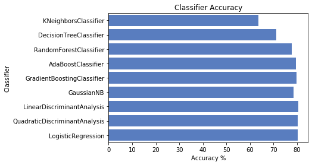

# NBA Predicter

This project contains a data pipeline which collects NBA statistics and uses box score data to predict whether a given team will win or lose a given game. This project also compares various machine learning classifier algorithms to demonstrate which are most accurate for the prediction process (see plot).

<p align="center">
 
 </p>
 <p align="center">
Accuracy results for 9 common classifiers with fixed features
</p>


### Contents

The [NBA Predictor Jupyter Notebook](https://github.com/Will-Wright/NBA-predicter/blob/master/NBA%20Predicter.ipynb) demonstates how to use all of the methods in this project.  Use this notebook to run the full pipeline and generate the plot above.

The data pipeline is split into two classes which can be found in the `src` folder.  

 - `DataProcessor` handles acquisition, integration, and processing.  
 - `DataClassifier` handles modeling (selecting features, params, classifiers), classifying, evaluation, and plotting results.  

The `data_raw` and `data_processed` folders contain previously scraped data for NBA seasons 2000-2001 to partway through 2019-2020.  To update data, just call `DataProcessor.update_and_process_all_data()`.

### Prerequisites

This project requires Python 3 and the following packages:

```
sklearn
pandas
seaborn
basketball_reference_web_scraper
```

You can find the web scraper at https://github.com/jaebradley/basketball_reference_web_scraper.


### Running Tests

To run the entire data pipeline on your local machine, just follow the [NBA Predictor Jupyter Notebook](https://github.com/Will-Wright/NBA-predicter/blob/master/NBA%20Predicter.ipynb).


## Future work

- Add new data to dataset: advanced statistics, number games on the road, etc.
- Use [WEKA machine learning models](https://www.cs.waikato.ac.nz/ml/weka/)
