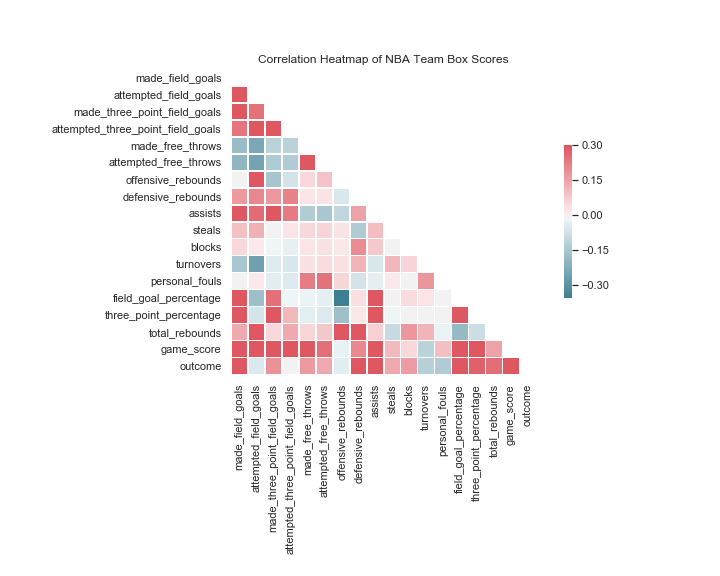
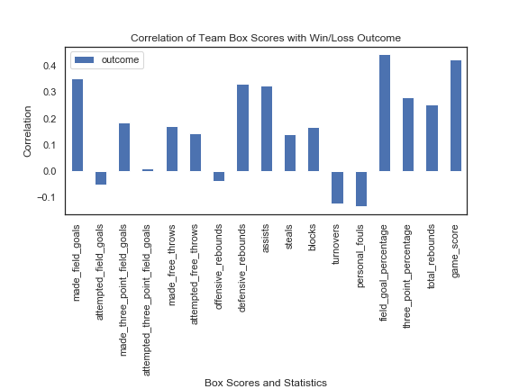
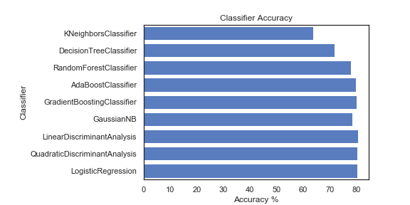

# NBA Predicter

This project contains a data pipeline which collects NBA statistics and uses box score data to predict whether a given team will win or lose a given game. This project also compares various machine learning classifier algorithms to demonstrate which are most accurate for the prediction process.


### Introduction

The long-term goal of this project is to use all relevant available data and tune the best performing machine learning algorithms to identify an optimal method for predicting the outcome of future basketball games.

Current version of this package uses the box score data of a specific team (and not their opponent) to predict the win/loss outcome for a game which has already been played.  Of course, the box score data for a given game would not be available to predict future games.  The purpose of this step of modeling is to do the following:

- identify the best candidate features for future methods,
- identify the best potential machine learning algorithms for outcome prediction,
- offer a comprehensive data pipeline which is easy to use, modify, and update.


The following heatmap and bar graph help us identify candidate features (NBA stats) to use in the classification phase of the pipeline.  For instance, the bar graph shows that game outcome has a high positive correlation with `made_field_goals` and `field_goal_percentage`, and a high negative correlation with `personal_fouls`, suggesting that these features should be used in modeling.  (See [NBA Predictor Jupyter Notebook](https://github.com/Will-Wright/NBA-predicter/blob/master/NBA%20Predicter.ipynb) to generate these plots.)

<p align="center">
 
 </p>
 <p align="center">
</p>

<p align="center">
 
 </p>
 <p align="center">
</p>


Using a few of these features, we see that the following algorithms perform with the accuracies indicated.

<p align="center">
 
 </p>
 <p align="center">
</p>


### Contents

The [NBA Predictor Jupyter Notebook](https://github.com/Will-Wright/NBA-predicter/blob/master/NBA%20Predicter.ipynb) demonstates how to use all of the methods in this project.  Use this notebook to run the full pipeline and generate the plot above.

The data pipeline is split into two classes which can be found in the `src` folder.  

 - `DataProcessor` handles acquisition, integration, and processing.  
 - `DataClassifier` handles modeling (selecting features, params, classifiers), classifying, evaluation, and plotting results.  

The `data_raw` and `data_processed` folders contain previously scraped data for NBA seasons 2000-2001 to partway through 2019-2020.  To update data, just call `DataProcessor.update_and_process_all_data()`.

### Prerequisites

This project requires Python 3 and the following packages:

```
sklearn
pandas
seaborn
basketball_reference_web_scraper
```

You can find the web scraper at https://github.com/jaebradley/basketball_reference_web_scraper.


### Running Tests

To run the entire data pipeline on your local machine, just follow the [NBA Predictor Jupyter Notebook](https://github.com/Will-Wright/NBA-predicter/blob/master/NBA%20Predicter.ipynb).


## Future work

- Add new data to dataset: advanced statistics, number games on the road, etc.
- Use [WEKA machine learning models](https://www.cs.waikato.ac.nz/ml/weka/)
